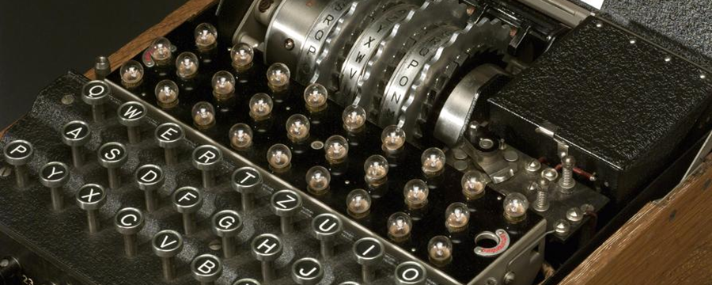

<h1 align="center"> FelipedelosH </h1>
<br>
<h4>EnigmaMachineByLoko V2.0</h4>


<br>
:construction: Project Status: In Progress :construction:
<br><br>
This repository contains my personal implementation of a custom encryption algorithm inspired by the historical Enigma machine.  
Unlike classical simulators, this project is **not** a graphical representation but rather my own logic and algorithm for generating encrypted text using circular linked lists and rotor mappings.

## :hammer:Funtions:

- `Function 1`: Neque porro quisquam est qui dolorem ipsum quia dolor sit amet.<br>
- `Function 2`: Neque porro quisquam est qui dolorem ipsum quia dolor sit amet.<br>
- `Function 3`: Neque porro quisquam est qui dolorem ipsum quia dolor sit amet.<br>
- `Function 3a`: Neque porro quisquam est qui dolorem ipsum quia dolor sit amet.<br>
- `Function 4`: Neque porro quisquam est qui dolorem ipsum quia dolor sit amet.<br>


## Configure your .env file:

```
alphabet="abcdefghijklmnñopqrstuvwxyzáéíóú0123456789"
password="your_secret_key_here"
```

## :play_or_pause_button:How to execute a project

```
execute main.py file
```

## :hammer_and_wrench:Tech.

- python

## :warning:Warning.

- Intended for learning and experimentation with data structures and encryption logic.

## Autor

| [<br><sub>Andrés Felipe Hernánez</sub>](https://github.com/felipedelosh)|
| :---: |